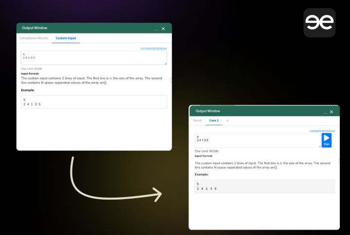

# GFG - Unlocking Powers

## Description
GFG - Unlocking Powers is a Chromium-based extension designed to elevate your experience on the *GeeksforGeeks* problem-solving website. This extension provides the functionality of creating and managing **multiple test cases** in tabs instead of having a single tab for custom input. 

## Features
- **Multiple Test Cases in Tabs**: Easily create and manage multiple test cases.
- **Keyboard Shortcuts**:
  - `Ctrl + ;`: Open test case tab
  - `Ctrl + '` : Compile and run
  - `Ctrl + Enter`: Submit your code
  - `Ctrl + Alt + >` or `Ctrl + >`: Add a new test case with the selected tab value or a new test case with the wrong output for the given input
  - `Ctrl + Alt + <` or `Ctrl + <`: Remove the current test case

## Installation
To add an unpacked extension to your browser, follow these steps:

1. **Download the Extension**: Ensure you have the extension files on your local machine.

2. **Open Chrome Extensions Page**:
   - Open Chrome.
   - Type `chrome://extensions/` in the address bar and press Enter.

3. **Enable Developer Mode**:
   - Toggle the switch on the top right corner to enable Developer Mode.

4. **Load Unpacked Extension**:
   - Click on the "Load unpacked" button.
   - Select the directory where your extension files are located.

Your extension should now be installed and active.

## Screenshots

## Live Link
The extension is currently *in review* for the Chrome Web Store and Microsoft Edge Add-ons.

## Future Goals
We are actively working on upcoming versions to enhance performance and add more features for a better user experience. Planned features include:
- Persistent storage of test cases with user-defined time.
- Customizable shortcuts.

---

Feel free to customize this further based on your needs.

